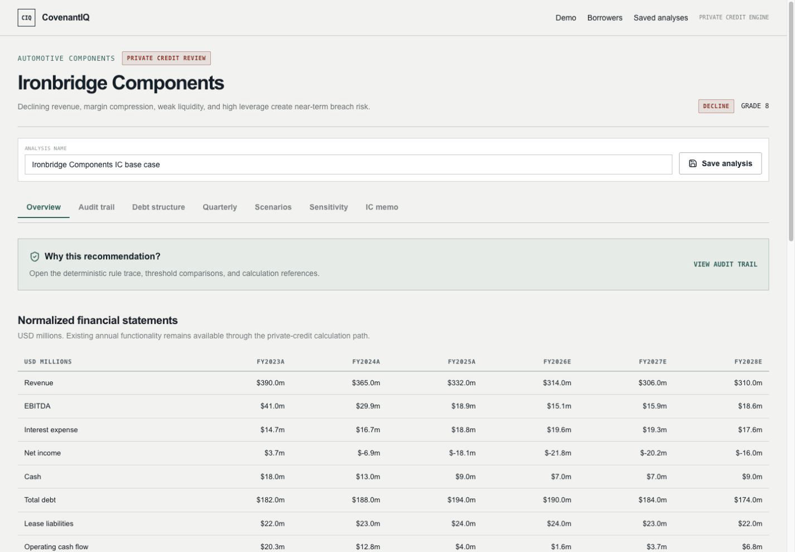
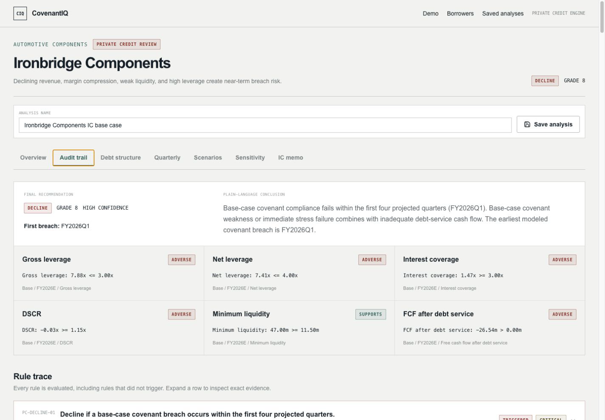
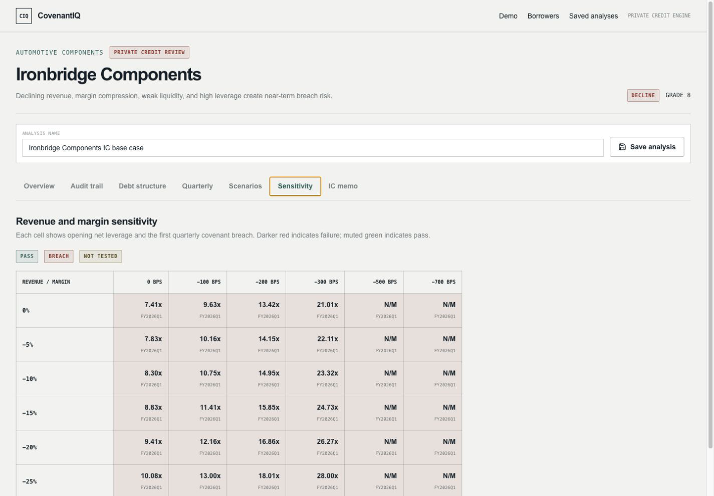
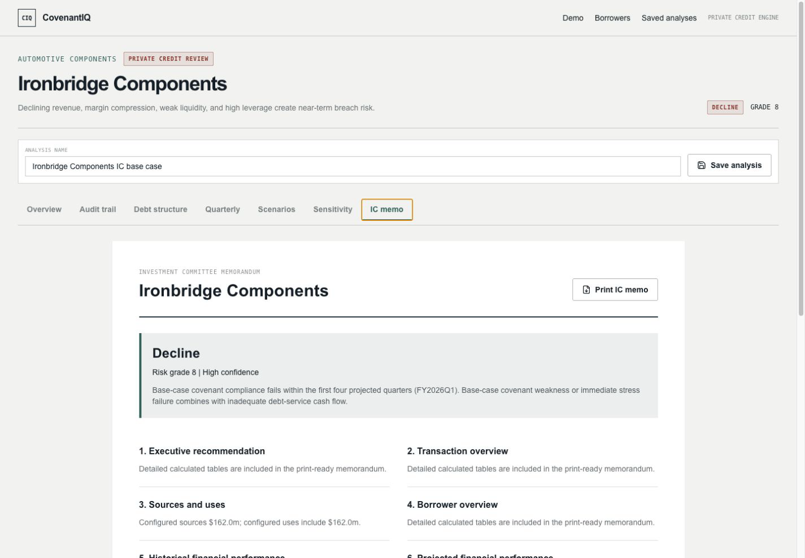
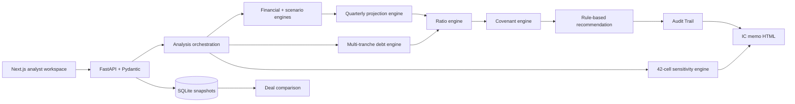

# CovenantIQ

> A traceable private-credit underwriting workbench for debt structure, covenant stress, downside analysis, and preliminary credit decisions.

**CovenantIQ is a deterministic private-credit analysis platform that models multi-tranche debt, quarterly covenant compliance, downside sensitivity, saved deal structures, and investment-committee memo generation.**

CovenantIQ is a portfolio and educational project built to demonstrate how finance logic, product design, and full-stack engineering can meet in one auditable workflow. Python calculates every balance, ratio, covenant result, sensitivity cell, comparison score, and recommendation. No LLM or external AI API performs financial calculations.



[Open the live application](https://covenantiq-eight.vercel.app/) · [Check backend health](https://covenantiq-api.onrender.com/health) · [View the 90-second demo script](docs/demo-script.md) · [Read the one-page brief](docs/project-brief.md) · [Open the sample IC memo](docs/sample_outputs/ironbridge_ic_memo.html)

`Next.js 16` · `TypeScript` · `Tailwind CSS` · `Recharts` · `FastAPI` · `Pydantic` · `SQLite` · `Pytest`

**Verified release:** 26 backend tests passing · frontend production build passing · deterministic calculation engine · no LLM-based financial calculations

## What it demonstrates

Credit work is often fragmented across spreadsheets, covenant trackers, memo templates, and judgment calls that are difficult to reproduce. CovenantIQ creates one inspectable chain:

```text
Borrower statements → debt schedule → credit ratios → quarterly covenants
                    → downside sensitivity → rule-based decision → audit trail → IC memo
```

An analyst can:

- Review five fictional borrowers with normalized historical and projected statements.
- Structure revolver, senior secured, and subordinated or mezzanine tranches.
- Calculate annual and quarterly leverage, coverage, debt service, liquidity, and cash flow.
- Test covenant packages and identify the first quarterly breach.
- Run five downside cases and a 42-cell revenue/margin sensitivity grid.
- Save exact request and calculated-response snapshots in SQLite.
- Compare saved structures using a disclosed deterministic safety score.
- Trace each recommendation to rules, metrics, thresholds, periods, and scenarios.
- Generate a print-optimized, sixteen-section investment-committee memo.

## Two cases to review

### Vantage Services: healthy approval

Vantage is the healthy asset-light demonstration case. In the verified default structure it remains approvable in base and mild downside cases, supported by coverage, positive free cash flow after debt service, liquidity headroom, and no early base-case covenant breach.

### Ironbridge Components: distressed decline

Ironbridge is the stressed demonstration case. Its default private-credit analysis produces **Decline**, risk grade **8**, and a first modeled breach in **FY2026Q1**. The Audit Trail shows the exact triggered decision rule and failed threshold comparison rather than generating an unsupported narrative.



## Product gallery

| Analysis workspace | Sensitivity matrix | Investment-committee memo |
|---|---|---|
| [](docs/assets/analysis-workspace.png) | [](docs/assets/sensitivity-heatmap.png) | [](docs/assets/ic-memo.png) |

More evidence: [landing](docs/assets/landing-page.png) · [borrower selection](docs/assets/borrower-selection.png) · [multi-tranche schedule](docs/assets/multi-tranche-debt-schedule.png) · [quarterly covenants](docs/assets/quarterly-covenants.png) · [saved analyses](docs/assets/saved-analyses.png)

## Architecture



Calculation modules are independent of FastAPI and React. API routes validate and orchestrate requests; they do not contain finance formulas. Saved cases retain both validated inputs and the exact calculated response so reopening does not silently recalculate a prior decision.

## Deterministic calculation philosophy

- Debt balances roll forward from explicit tranche terms.
- Cash interest uses average cash-pay balances; optional PIK accrues to principal.
- Ratios return `valid`, `not_meaningful`, or `unavailable` instead of a misleading zero.
- Scenario shocks change statements, working capital, rates, and liquidity before ratios are calculated.
- Maximum-covenant headroom is `threshold - actual`; minimum-covenant headroom is `actual - threshold`.
- Recommendations and comparison results come from named, reviewable rules.
- The interface and memo present calculated evidence; they do not invent borrower claims.

See [financial methodology](docs/methodology.md), [data dictionary](docs/data-dictionary.md), and [API reference](docs/api.md).

## Run locally

Prerequisites: Python 3.12+ and Node.js 20+.

```bash
python3 -m venv .venv
source .venv/bin/activate
pip install -r backend/requirements.txt
cd frontend && npm install && cd ..
cp backend/.env.example backend/.env
cp frontend/.env.example frontend/.env.local
```

The application reads process environment variables directly. Uvicorn can load the copied backend file with `--env-file`.

Terminal 1:

```bash
cd backend
../.venv/bin/uvicorn app.main:app --env-file .env --reload --port 8000
```

Terminal 2:

```bash
cd frontend
npm run dev
```

Open `http://localhost:3000`. API documentation is at `http://localhost:8000/docs`; `GET http://localhost:8000/health` returns service status and confirms deterministic calculation mode.

Five fictional borrower records are checked in at `backend/app/data/borrowers.json` and are available on every clean start. The SQLite schema initializes automatically. Saved analyses are intentionally **not** pre-seeded and begin empty in a fresh database.

## Verify the release

```bash
cd backend
../.venv/bin/pytest -q

cd ../frontend
npm run build
```

Verified v1.0 result: **26 tests passed** and the Next.js production build completed successfully. Tests cover legacy annual calculations, multi-tranche roll-forwards, quarterly covenants, downside behavior, sensitivity, persistence, recommendation rules, Audit Trail evidence, structure comparison, guided-demo validity, and memo output.

## Deploy

Recommended public portfolio topology:

```text
Vercel (frontend) → Render / Railway / Fly.io (one FastAPI instance + persistent disk) → SQLite
```

1. Deploy `backend/` to a stateful service and mount persistent storage at `/var/data` or `/data`.
2. Set `ENVIRONMENT=production`, `COVENANTIQ_DB_PATH` to the mounted database path, and `CORS_ORIGINS` to the exact Vercel production and preview origins.
3. Deploy `frontend/` on Vercel and set `NEXT_PUBLIC_API_URL` to the backend HTTPS origin.
4. Rebuild the frontend after changing `NEXT_PUBLIC_API_URL`; `NEXT_PUBLIC_*` values are embedded at build time.
5. Confirm `/health`, `/borrowers`, and one saved-analysis cycle before sharing the URL.

The checked-in [Render Blueprint](render.yaml) provides the recommended persistent-disk backend path. A portable [backend Dockerfile](backend/Dockerfile) supports Railway or Fly.io. Exact platform commands, CORS examples, health checks, and rollback notes are in [docs/deployment.md](docs/deployment.md).

SQLite is not appropriate for a serverless or ephemeral backend filesystem. Run a single backend instance with a persistent disk for this portfolio release. A later multi-instance release should migrate persistence to managed PostgreSQL.

## Documentation

- [Demo script](docs/demo-script.md)
- [One-page project brief](docs/project-brief.md)
- [Portfolio talking points](docs/portfolio-talking-points.md)
- [Sample outputs index](docs/sample_outputs/README.md)
- [Deployment guide](docs/deployment.md)
- [Architecture](docs/architecture.md)
- [Financial methodology](docs/methodology.md)
- [Known limitations](docs/known-limitations.md)

## Known limitations

- Borrowers, transactions, covenant thresholds, and recommendation policies are fictional and educational.
- Quarterly results phase annual projections using simplified seasonality rather than a monthly operating model.
- Revolver mechanics omit borrowing bases, daily draws, letters of credit, and intra-quarter liquidity peaks.
- SQLite supports a simple single-instance demo, not authenticated multi-user production use.
- No authentication, legal covenant-document parsing, lender policy calibration, market feed, or third-party borrower data.
- Memo output is print-optimized HTML rather than a server-rendered PDF.
- Audit and comparison rules are transparent heuristics, not statistically calibrated ratings.

Read the complete [known limitations](docs/known-limitations.md).

## Roadmap

1. Managed PostgreSQL and authenticated, versioned review workflows
2. Monthly cash forecasting and dynamic revolver mechanics
3. Covenant step-downs, cures, baskets, and reviewed EBITDA add-backs
4. Portfolio exposure and concentration views
5. PDF rendering with page-level regression tests

## Disclaimer

CovenantIQ is an educational portfolio project. It does not constitute lending, investment, accounting, legal, or financial advice and does not replace professional underwriting judgment, lender policy, legal-document review, or independent verification of borrower information.
